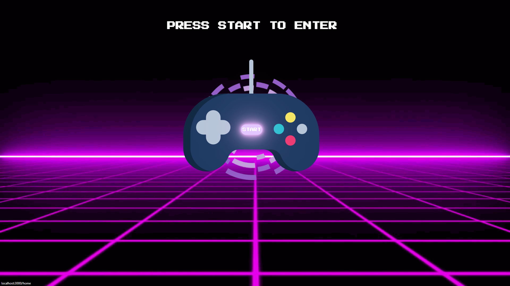
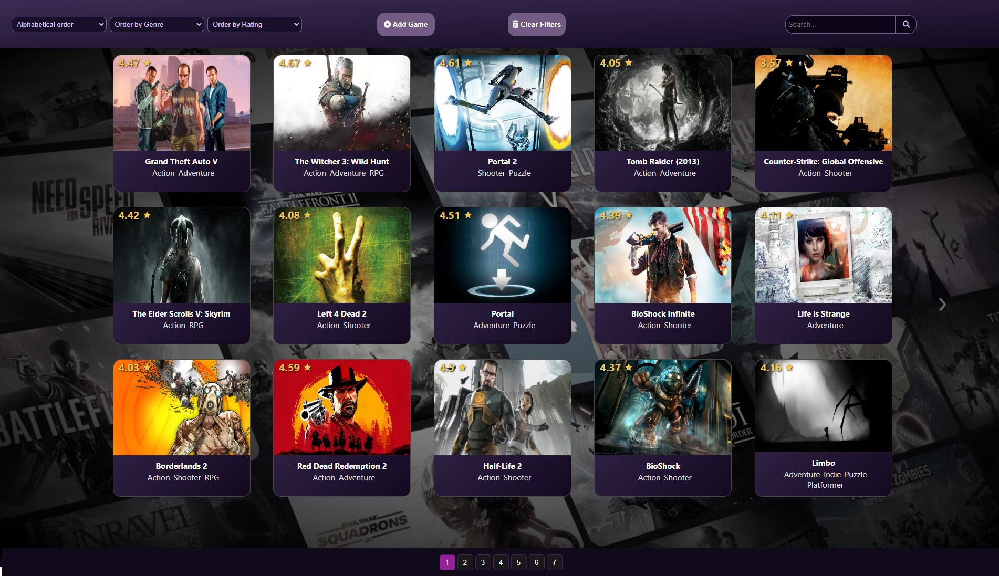
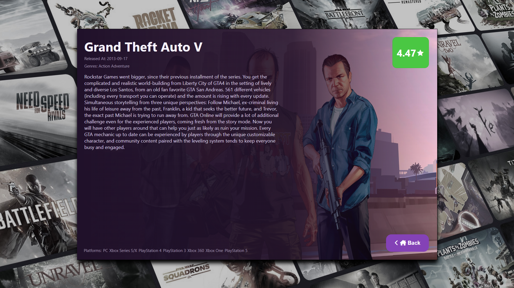
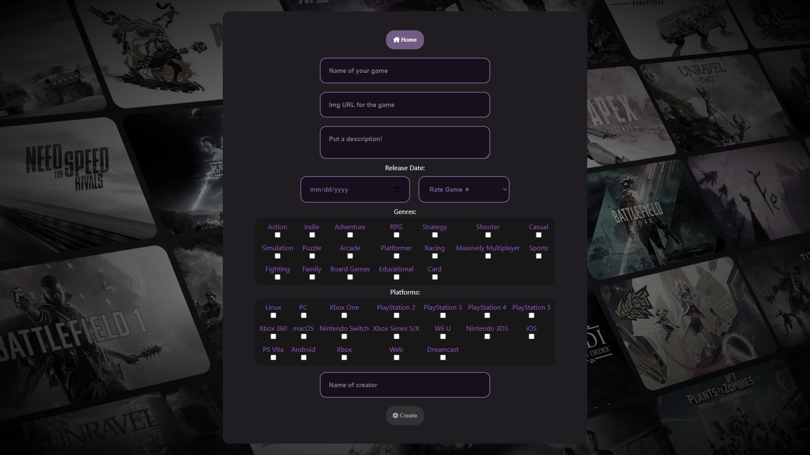
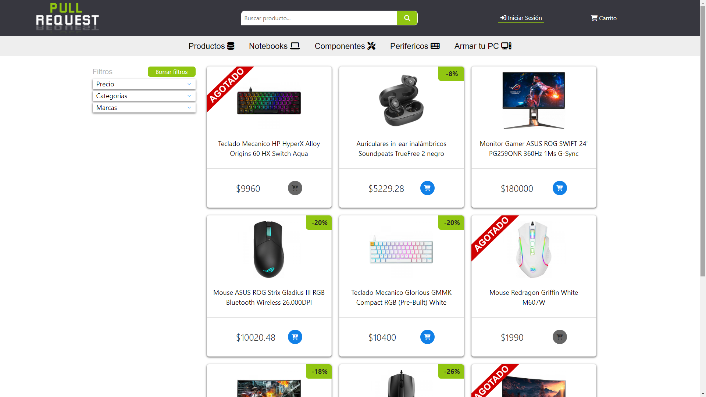
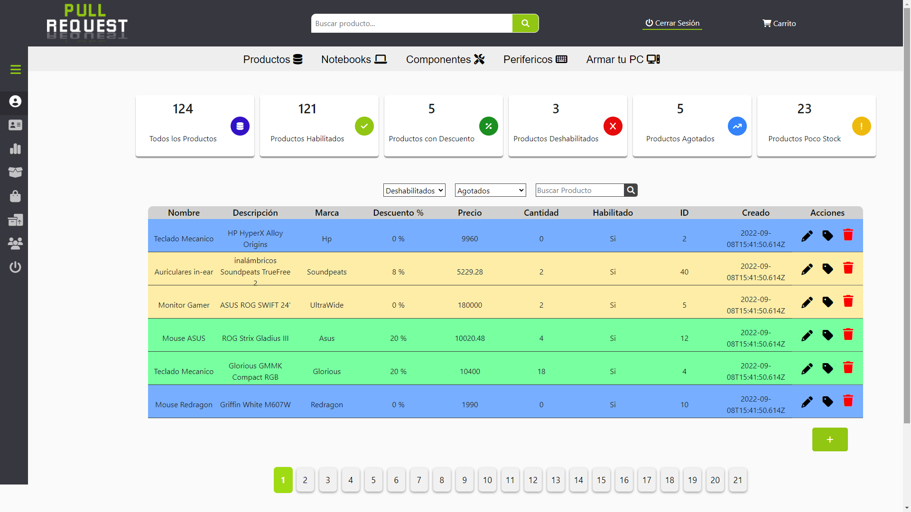
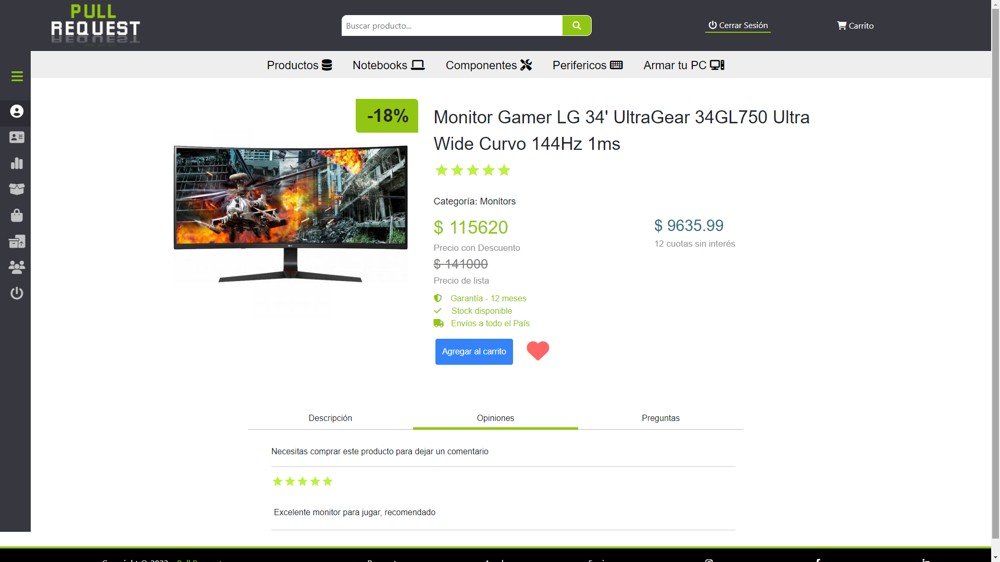

<!-- 

    

 -->

# Hi there, I´m Leonel! 👾
### Full stack web developer* 
*Also video game lover

The part that enjoy the most of a project is when I am listening to the client and the vision they have of their product. Also love giving it a really cool view!

## Checkout my work
👇
👇
👇   
____________________
## VIDEOGAMES 

📌 Videogames web where you can find any game!

🚀 Technologies: 
React - Redux - Bootstrap - NodeJS- Express - PostgreSQL 

____________

## PULL REQUEST 

📌 Developed with the aim of improving the building process of PC gamming

🚀 Technologies: 
React - Redux - Material UI - NodeJS- Express - PostgreSQL - Auth0 - Cloudinary  

<!-- 
 -->

## ⚡Languages and Tools:

*Front*

            
          

     

*Back*

    

*Testing*

 

*Design Tools*

  

*Others*

  

___________________________________________

## 📫 CONTACT ME

Have a question or want to work together? 

**Email:** leonelfrobledo@gmail.com

